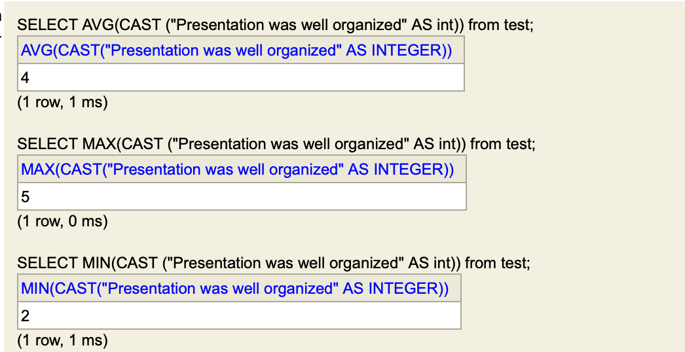
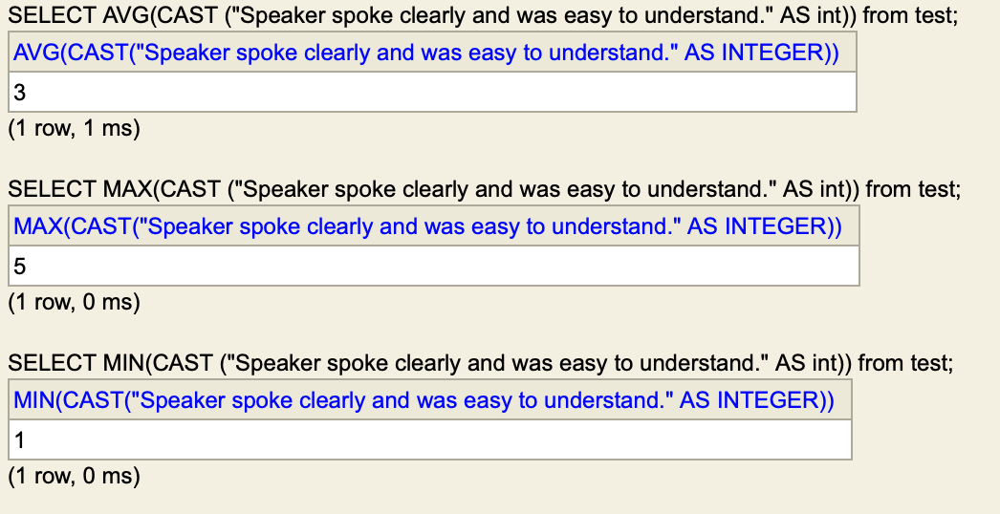
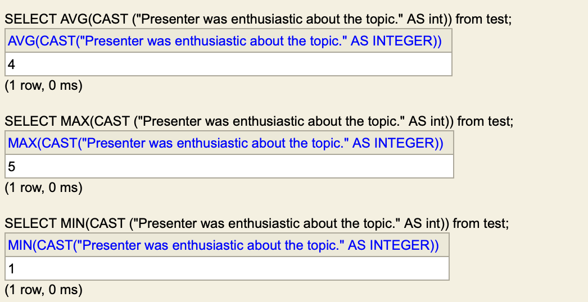
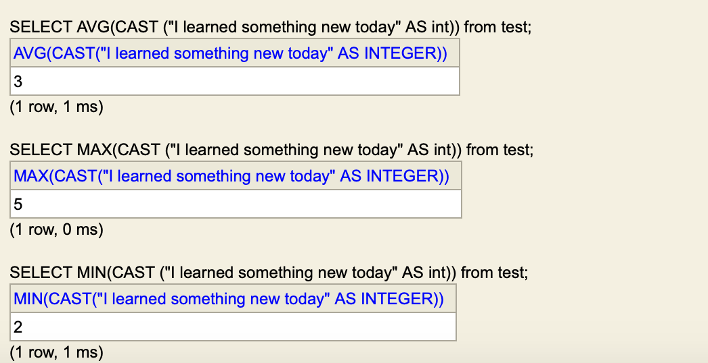

__HomeWrok#6 Extra_Credit__

### This is to import CSV file to the sql

CREATE TABLE TEST AS SELECT * FROM CSVREAD('HomeWork#6.csv');

### To Create the table name call test and to select the test table.

select * from test;

### To count columns1 average, max, min 

SELECT AVG(CAST ("Presentation was well organized" AS int)) from test;
SELECT MAX(CAST ("Presentation was well organized" AS int)) from test;
SELECT MIN(CAST ("Presentation was well organized" AS int)) from test;

### To count columns2 average, max, min 

SELECT AVG(CAST ("Speaker spoke clearly and was easy to understand." AS int)) from test;
SELECT MAX(CAST ("Speaker spoke clearly and was easy to understand." AS int)) from test;
SELECT MIN(CAST ("Speaker spoke clearly and was easy to understand." AS int)) from test;

### To count columns3 average, max, min 

SELECT AVG(CAST ("Presenter was enthusiastic about the topic." AS int)) from test;
SELECT MAX(CAST ("Presenter was enthusiastic about the topic." AS int)) from test;
SELECT MIN(CAST ("Presenter was enthusiastic about the topic." AS int)) from test;

### To count columns3 average, max,min 

SELECT AVG(CAST ("I learned something new today" AS int)) from test;
SELECT MAX(CAST ("I learned something new today" AS int)) from test;
SELECT MIN(CAST ("I learned something new today" AS int)) from test;}

>Output Columns1 average, max,min

</a>

>Output Columns2 average, max,min

</a>

>Output Columns3 average, max,min

</a>

>Output Columns4 average, max,min

</a>
