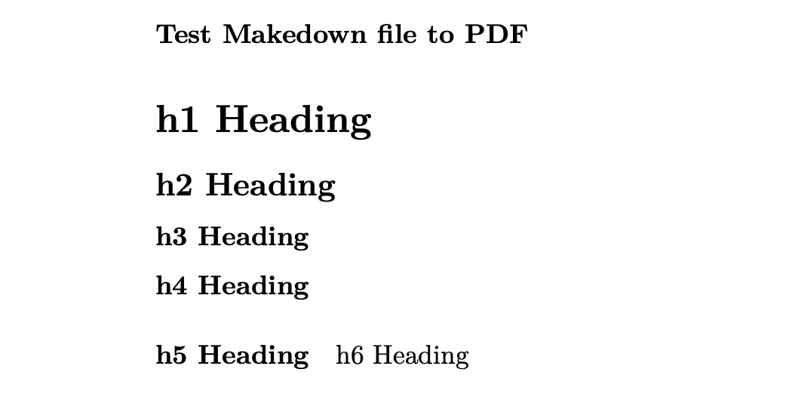

__How to Install Pandoc on the Mac to use makedown file to PDF file__

###### Links for downlord Pandoc

__<a href="https://pandoc.org/installing.html" target="_blank">Pandoc</a>__

###### First: Install Pandoc on the Mac

###### Second: Create makedown file to use the terminal to change PDF 

</a>

###### Third: Use the code (pandoc Text.md -o Text.pdf)

</a>

###### Fourth: open the PDF: 

</a>